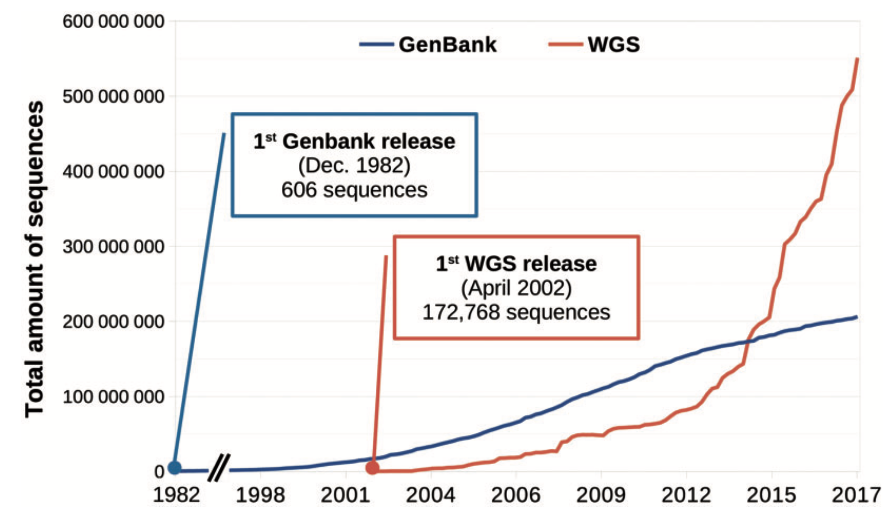
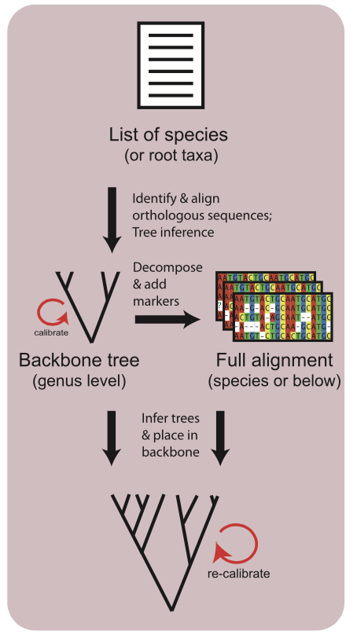

```{r setup, include=FALSE}
knitr::opts_chunk$set(echo = TRUE, cache = TRUE)
library(xaringanthemer)
library(ftolr)
library(ggtree)
library(ggtext)
library(ggdark)
library(scico)
library(patchwork)
library(tidyverse)
style_mono_accent(
  base_color = "#006682",
  text_font_size = "1.2rem",
  extra_css = list(
    ".small" = list("font-size" = "60%")
  ))

# Set up bibliography
bib <- "references.yaml"
csl <- "ecology.csl"
context <- "index.Rmd"

```

````{css, echo = FALSE}
.black_bg {
  background-color: #202020;
}
```

## An Open and Continuously Updated Fern Tree of Life (FTOL)

**Joel Nitta<sup>1</sup>**, Eric Schuettpelz<sup>2</sup>, Santiago Ramírez-Barahona<sup>3</sup>,  
Wataru Iwasaki<sup>1</sup>

<span style = 'font-size: 60%;'>1: The University of Tokyo, 2: Smithsonian Institution, 3: Universidad Nacional Autónoma de México</span>

ISMB 2022 EvolComGen COSI 2022-07-14

https://joelnitta.github.io/ismb_2022

---
## We are awash in DNA sequence data

.center[

]

.footnote[
  `r cite_pd("[@Gauthier2019]")`
]

---
## Harnessing open data to build maximally-sampled trees

.pull-left[
Automated pipelines:

- pyPHLAWD `r cite_pd("[@Smith2019]")`
- superSMART `r cite_pd("[@Antonelli2016]")`
- superCRUNCH `r cite_pd("[@Portik2020]")`
- others...
]

.pull-right[
  .center[
    
    <br>
    <span style = 'font-size: 60%;'>`r cite_pd("@Antonelli2016")` </span>
  ]
]

---
## The problem: tradeoff between scalability and accuracy

- Any automated pipeline must make **shortcuts** and **assumptions**

- **Manual inspection** of all sequences would lead to high-quality results, **but does not scale**

.center[

]

---
## Our approach: combine automation with customization

Goal: to construct a **maximally sampled**, **high taxonomic quality** phylogeny of **ferns**

---
## Why ferns?

A large, diverse, ecologically important group of plants

But much more tractable than seed plants (angiosperms):
- Ferns: ca. 12,000 species, 40-50% sequenced
- Seed plants: ca. 350,000 species, 20% sequenced

---
## Fern sequences in GenBank, 1990-2021

Sanger sequenced plastid genes have been the workhorse of fern molecular systematics

NGS (whole-genome sequencing) is gradually catching up

<!-- MS fig 1 -->

---
## Building materials

- Sanger-sequenced plastid genes: maximal sampling of species (**few genes, many taxa**)

- NGS plastomes: robust resolution of backbone (**many genes, few taxa**)

---
class: inverse, center, middle

# Methods

---
## Overview of workflow

<!-- workflow fig -->

---
## Workflow highlights

- Increase efficiency and reproducibility of working with GenBank data by creating a **local DB**
- Extract sequences **without relying on GenBank annotations**
- Implement a **custom fern taxonomy**
- Use **two-step phylogenetic analysis** to maximize accuracy and sampling
- Incorporate **automated** and **manual** checks for rogues

---
## Increase efficiency and reproducibility of working with GenBank data by creating local DB

[restez](https://github.com/ropensci/restez)\* R package

- Download portion ("plants" division) of GenBank from FTP site (v249, cutoff date 2022-04-15, ca. 170 gb)
- Put only fern and outgroup sequences into local DB (mariaDB, ca. 400 mb)
- Post DB in [figshare](https://figshare.com/articles/dataset/Fern_Tree_of_Life_FTOL_input_data/19474316) so others can use

.footnote[\*I am current maintainer; if you have questions, please ask!]

---
## Extract sequences without relying on GenBank annotations

There is **no standard** for how to annotate GenBank accessions

- Curate set of reference sequences (one sequence per genus) based on well-annotated accessions
- Use these as a BLAST DB to extract matching regions from each fern accession with superCRUNCH `r cite_pd("[@Portik2020]")`

---
## Implement a custom fern taxonomy

NCBI species names include many **synonyms**

- Used [Catalog of Life](https://www.catalogueoflife.org/) as basis for new, fern-specific taxonomic database, [pteridocat](https://github.com/fernphy/pteridocat)
  - Built database with [dwctaxon](https://github.com/joelnitta/dwctaxon)\* R package (handles taxonomic data in compliance with [Darwin Core](https://dwc.tdwg.org/terms/#taxon) standard)

- Resolved GenBank species names to pteridocat using [taxastand](https://github.com/joelnitta/taxastand)\* R package
  - Matches taxonomic names to a custom database, while accounting for spelling differences and taxonomic idiosyncrasies

.footnote[\*I am the developer; if you have questions, please ask!]

---
## Use two-step phylogenetic analysis to maximize accuracy and sampling

Step 1: Plastome backbone (423 species x 79 loci)

Step 2: Use plastome backbone as constraint tree for analysis of Sanger dataset (5,582 species x 7 loci)

(also tried supermatrix, but this was much slower: ca. 1 month vs. 10 days)

---
## Incorporate automated and manual checks for rogues

Automated
- All-by-all BLAST
- Exclude any sequences that matched the wrong family

Manual
- Construct initial tree in "fast" mode with IQ-TREE `r cite_pd("[@Nguyen2015]")`
- Analyze monophyly (genus level and higher) with MonoPhy R package `r cite_pd("[@Schwery2016]")`
- Consult with taxonomic experts
- Curate exclusion list of accessions to avoid

---
class: inverse, center, middle

# Results

---
background-image: url(images/cov_tree.png)
background-size: contain

## FTOL v1.1.0

---
background-image: url(images/bs_tree.png)
background-size: contain
class: inverse, black_bg

## FTOL v1.1.0

```{r bs-plot, echo = FALSE, run = FALSE, message = FALSE, warning = FALSE, out.width = 100}

phy <- ftolr::ft_tree(drop_og = TRUE)

# Make a dataframe (tibble) with node IDs (integers) and their corresponding
# bootstrap support values. The tibble has two columns: one called "node",
# the other can be named as we like (here, "bootstrap")
bs_tibble <- tibble(
  # hard-code node ID: internal nodes start after tip nodes,
  # and phy$node.label is in the same order as internal nodes
  node = seq_len(Nnode(phy)) + Ntip(phy),
  bootstrap = parse_number(phy$node.label))

# Use the ggtree::`%<+%` operator to map the bootstrap values onto the tree

bs_tree_plot <- ggtree(
    phy, layout = "fan", size = 0.25, color = "grey70") %<+% bs_tibble +
  geom_nodepoint(aes(color = bootstrap), size = 0.75) +
  scale_color_viridis_c(option = "C") +
  labs(color = "BS") +
  theme(
    panel.background = element_rect(fill = "grey10", colour = NA),
    plot.background = element_rect(fill = "grey10", colour = NA),
    legend.position = "none")

# export image to working dir, then edit in powerpoint. too hard to get
# sizes to work as desired in Rmarkdown
ggsave(
  plot = bs_tree_plot, file = "working/bs_tree_plot.png",
  width = 10, height = 10, units = "in")

# Also make distribution plot of node support values
support <- tibble(
  bs = parse_number(phy$node.label)) %>%
  filter(!is.na(bs))

support_counts <-
support %>%
  mutate(bin = cut_width(bs, width = 1, center = 0.5)) %>%
  group_by(bin) %>%
  summarize(
    count = n(),
    .groups = "drop"
  ) %>%
  mutate(
    bin_start = str_match(bin, "(\\d+)\\,") %>%
      magrittr::extract(,2) %>%
      parse_number()) %>%
  mutate(bin_start = bin_start / 100)

n_nodes <- nrow(support) %>% scales::number(big.mark = ",")

# Dark version
bs_histogram <- ggplot(support_counts, aes(x = bin_start, y = count, fill = bin_start)) +
  geom_col() +
  scale_x_continuous(labels = scales::percent) +
  scale_fill_viridis_c(option = "C", labels = scales::percent) +
  labs(
    x = "BS",
    y = "Count",
    fill = "BS"
  ) +
  dark_theme_gray(base_size = 16) +
  theme(
    plot.subtitle = element_markdown(),
    panel.background = element_rect(fill = "grey10", colour = NA),
    plot.background = element_rect(fill = "grey10", colour = NA),
    legend.background = element_rect(fill = "grey10", colour = NA),
    legend.position = "right")

ggsave(
  plot = bs_histogram, file = "working/bs_histogram.png")
```


---
## Revising the timeline of fern diversification

- We conducted dating analysis (penalized likelihood with treePL `r cite_pd("[@Smith2012]")`) using 51 fossils (2x more than previous)
- Pushes back stem ages for most families ca. 50 my
- Suggests ferns did not diversify "in the shadow" of angiosperms

---
## Web portal

https://fernphy.github.io/

- Data downloads
- Shiny app for exploring data

<!-- web site screen shot -->

---
## R package "ftolr"

https://github.com/fernphy/ftolr

- Read tree and data (alignments) directly into R
- Options for outgroups, rooting, locus selection, etc.

<!-- ftolr screen shot -->

---
## Community involvement

Consulted with a taxonomic expert on family Thelypteridaceae (S. Fawcett) between v1.0.0 and v1.1.0
- Implemented "inclusion list" (preferred accessions for some species) based on recent phylogeny `r cite_pd("[@Patel2019]")`
- Number of non-monophyletic genera **dropped from 16 to 7**

---
class: inverse, center, middle

# Summary

---
## FTOL hits sweet spot between automation and customization

- Automated, versioned mining of GenBank data

- Open data, methods, and results

- Custom taxonomy tailored for ferns

- Input from taxonomic experts and broader community

---
## Future directions

- Completion of FTOL
   
   - "Unlocking the vault" of **herbarium specimens** via plastome skimming

- Integration with **Pteridophyte Phylogeny Group II**
    
    - Species-level, community-driven, living taxonomy

- Continue to provide tools (R packages) towards building **TOL**

---
## Acknowledgements

Japan Society for the Promotion of Science

Smithsonian National Museum of Natural History Peter Buck Fellowship

Members of the Iwasaki lab, The University of Tokyo

A.E. White

S. Fawcett

M. Hassler

---
## References

.small[
  `r bib_pd()`
]
